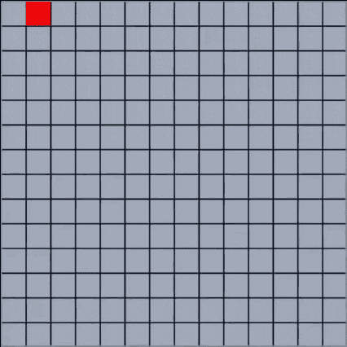

# Maze generator

C++\
QT 5.11.1\
Algorithm used: [Wikipedia](https://en.wikipedia.org/wiki/Maze_generation_algorithm#Recursive_backtracker)\
Presentation: [YouTube](https://www.youtube.com/watch?v=tnCdRwtMJCQ)\
Download: [Plik zip](https://github.com/rivit98/maze-generator/releases)

Demo:\
  
